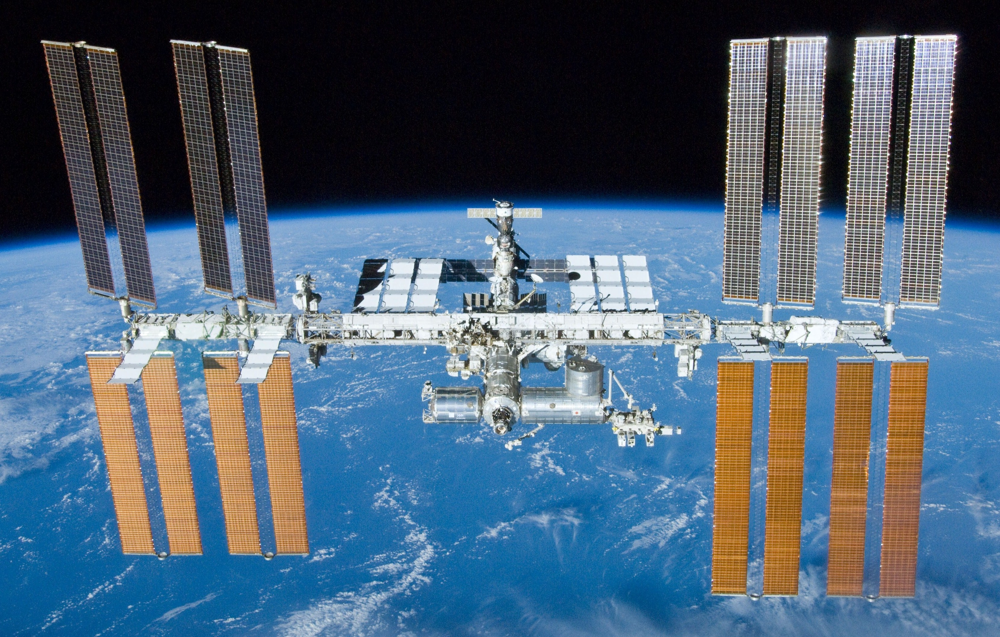

# 🚀 Escape Room: Flugt fra Rumstationen *Geometra*

**Elev-ark · matematik · 8. klasse · I arbejder i grupper på 3–4**

> **🛰️ Mission:** Rumstationen *Geometra* er gået i nødlukning. Luftslusen er forseglet, og
> stationens computer åbner kun, hvis I taster den rigtige **nødkode**. Koden er delt i fem
> systemer rundt på stationen. Løs alle fem opgaver, find de fem tal, og læg dem sammen. Så er I
> fri. Held og lykke, kadetter. ⏳

## Sådan gør I (læs det her først)

- I arbejder i grupper på **3–4**. **Lommeregner og formelsamling må bruges.**
- I kan løse de fem stationer i vilkårlig rækkefølge. Skriv hvert svar på **kode-arket** nederst.
- Når I har alle fem tal, lægger I dem sammen. Summen er **nødkoden**.
- **Selvtjek:** Har I regnet rigtigt, er nødkoden et **helt hundredetal** (fx 300, 400, 500 …). Hvis
  ikke, så find fejlen.
- **💡 Hint** under hver opgave giver et lille skub, uden at afsløre svaret. Brug det kun, hvis I sidder fast.
- **⭐ Ekstra** er en sværere bonus. Den ændrer ikke nødkoden, men giver ekstra rumkadet-ære.
- **🛰️ Flugt-logbog:** Ved mindst **én** station skal I skrive 2–3 sætninger, der forklarer jeres fremgangsmåde, så en anden gruppe kunne følge den ("Først …, fordi …; derefter …").

## Det her træner I (så I ved hvorfor)

I arbejder med rumfang og overfladeareal, Pythagoras, ligninger, procent og sandsynlighed. Og det
vigtigste: I øver jer i at oversætte en tekst til matematik og i at forklare jeres fremgangsmåde for
hinanden.

---

## 🛢️ Station 1: Lastrummet (rumfang)

Nødrationerne skal stå i et lastrum formet som en stor kasse: **6 dm lang, 5 dm bred, 4 dm høj.**
Midt igennem kassen løber et kølerør, der optager en udsparing (et hul) på **2 dm × 5 dm × 2 dm.**
Hvor mange kubikdecimeter (**dm³**) er der reelt plads til rationer i?

**Svar: __________ dm³**

> 💡 **Hint:** Regn rumfanget af hele kassen. Regn så rumfanget af hullet. Træk hullet fra.
>
> ⭐ **Ekstra:** Hvor mange liter svarer det til? (1 dm³ = 1 liter)

---

## 🛡️ Station 2: Skjoldet (overfladeareal og procent)

Et varmeskjold har form som en kasse: **10 dm lang, 5 dm bred, 2 dm høj.** Hele overfladen skal have
et beskyttelseslag. Beregn først skjoldets samlede overfladeareal. Læg derefter **25 % ekstra** til
(til spild og kanter). Hvor mange **dm²** beskyttelseslag skal I bestille?

**Svar: __________ dm²**

> 💡 **Hint:** En kasse har 6 sider, parvis ens: overfladeareal = 2 · (l·b + l·h + b·h). "25 %
> ekstra" betyder, at I ganger med **1,25**.
>
> ⭐ **Ekstra:** Laget koster **3 kr. pr. dm².** Hvad koster hele bestillingen?

---

## 📡 Station 3: Antennen (Pythagoras)

Kommunikationsmasten skal sikres. Masten er **36 m** høj og holdes af en barduns-wire, der går fra
mastens top skråt ned til et fæste **27 m** ude på jorden. Masten står lodret, så masten og jorden
danner en ret vinkel. Hvor lang skal wiren mindst være?

**Svar: __________ m**

**(b) Forklar:** Hvorfor kan man overhovedet bruge Pythagoras' sætning netop her? Hvad er det ved trekanten (den rette vinkel), der gør, at a² + b² = c²? Tegn trekanten, og vis, hvilken side der er hypotenusen — og hvorfor.

> 💡 **Hint:** Wiren er hypotenusen i en retvinklet trekant med kateterne 36 m og 27 m. Brug
> Pythagoras: c = √(36² + 27²).
>
> ⭐ **Ekstra:** Tegn trekanten i en passende målestok og mål wiren efter. Passer din måling med beregningen?

---

## 🧭 Station 4: Navigationen (ligning)

Autopiloten vil kun starte, når den får et **kurstal x**, der opfylder ligningen:

**6x − 30 = 4x + 120**

Løs ligningen, og find x.

**Svar: x = __________**

> 💡 **Hint:** Saml x'erne på den ene side af lighedstegnet og tallene på den anden. Hvad bliver 6x − 4x?
>
> ⭐ **Ekstra:** Autopiloten godtager kun en kurs, hvis også **2x + 10 < 200.** Overholder jeres kurs det?

---

## 🔌 Station 5: Sensoren (sandsynlighed)

I reservedelskassen ligger **20 sikringer.** **4 af dem er brændt af** (defekte). I trækker
tilfældigt **én** sikring. Hvad er sandsynligheden, i **procent**, for at I trækker en hel
(virkende) sikring?

**Svar: __________ %**

> 💡 **Hint:** Hvor mange af de 20 er hele? Sandsynlighed = gunstige ÷ mulige. Lav brøken om til procent.
>
> ⭐ **Ekstra:** I trækker to sikringer uden at lægge den første tilbage. Hvad er sandsynligheden for,
> at begge er hele? (Svar i procent, afrund.)

---

## 📊 Station 6: Iltloggen (statistik) — tæller *ikke* med i nødkoden

Sensoren har logget iltniveauet (%) i lastrummet hver time i otte timer: **19, 21, 20, 18, 22, 20, 21, 19.**

a) Find **middeltal**, **median** og **variationsbredde.**
b) Vælg et **passende diagram** til at vise udviklingen over tid, og **begrund** valget.
c) Alarmen udløses, hvis en måling kommer under **middeltallet.** Ved hvilke timer ville alarmen gå?

**Svar (a): middeltal _______ · median _______ · variationsbredde _______**

> 💡 **Hint:** Middeltal = læg alle tal sammen, og del med antallet (8). Median = det midterste tal, når de står i rækkefølge. Variationsbredde = største minus mindste.
>
> ⭐ **Ekstra:** Er middeltal eller median det mest retvisende "normaltal" her? Hvorfor?

---

## 🔓 Luftslusen: nødkoden

Saml jeres fem svar, og læg dem sammen:

| Station | Tal |
|---|---|
| 1 · Lastrummet (dm³) | |
| 2 · Skjoldet (dm²) | |
| 3 · Antennen (m) | |
| 4 · Navigationen (x) | |
| 5 · Sensoren (%) | |
| **NØDKODE (læg de fem sammen)** | |

Tast nødkoden i luftslusen. Er den et helt hundredetal? Så er I fri! 🎉

---

## ⭐ Bonus, hvis I når det (ræsonnement)

I fordobler **alle** mål på kassen fra **Station 1**, så den bliver 12 dm × 10 dm × 8 dm, og hullet
bliver 4 dm × 10 dm × 4 dm.

1. Hvor mange gange større bliver rumfanget?
2. Hvor mange gange større bliver overfladearealet?
3. Forklar med ord, hvorfor de to tal ikke er ens.

---

## 🫧 Modellerings-udfordring: Ilten skal række (tæller *ikke* med i nødkoden)

Stationens iltbeholdning er beregnet til **4 personer i 9 timer.** Men I er **6 kadetter** om bord. Hvor længe rækker ilten nu?

Opstil **selv** en model: Hvilke **antagelser** gør I (bruger alle lige meget? er forbruget jævnt)? Regn jeres svar ud. **Vurdér til sidst:** Hvad gør jeres model usikker i virkeligheden, og ville I stole på den med jeres liv?
